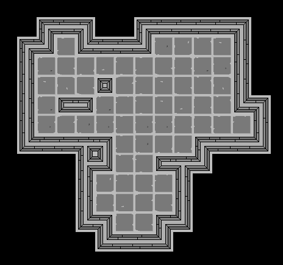
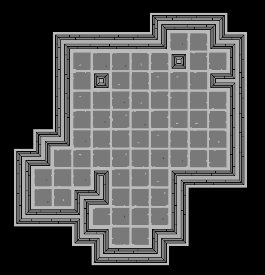
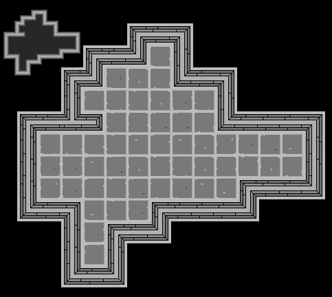
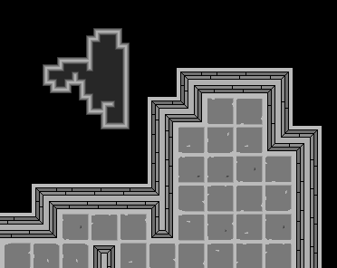

# Picnic in the Dungeon

Jogo de exploração de masmorras com foco no desenvolvimento de habilidades. As masmorras apresentarão alta dificuldade sendo a morte do personagem permanente, no entanto, armas, raças e habilidades serão liberadas para novos personagens à medida que objetivos da masmorra forem alcançados. Será oferecido um sistema de desenvolvimento de habilidades de modo que o usuário possa customizar o seu personagem e por esse motivo não serão fornecidas classes.

Além disso, o jogo também apresentará opções de customização de modo que o usuário possa gerar conteúdo. Isso inclui o desenvolvimento de cenários, quebra-cabeças, armadilhas, equipamentos, armas, poções, além do desenvolvimento de habilidades.

Simple ARPG with rogue like game elements:
- [ ] Turn Based (Strategy)
- [ ] Procedural Map Generation;
- [ ] Permanent Death;
- [ ] High difficulty;
- [ ] Powers Customization (like Daemon Supers[^1]);
- [ ] Rare and Champion Monsters (like Diablo 3[^2]);
- [ ] Puzzles (like Zelda[^3], Pokemon[^4], video games[^5], Goof a Troop[^16] and RPG[^6]);
- [ ] Races, Classes and Weapons (race customization by user choices);
- [ ] Dialog and Conversation Strategies;
- [ ] Environment Interaction (like Brogue[^14], Pokemon[^13] and Metroid[^15]);
- [ ] Weapons Strategy (like Brogue[^12]);
- [ ] Strange and Hostil Environment (like Roadside Picnic[^7] and Annihilation[^8] with elements of Debris[^9], Doctor Who[^10] and Darker than Black[^19]);
- [ ] Tower Defense Elements (like traps and defenses in Clash of Clans[^11]);
- [ ] Monster Capture (like Pokemon[^4]).

## Progresso

### Geração aleatória de mapas simples através do algoritmo de passeio aleatório.

    
    

### Geração de minimapa acessado pela tecla 'tab'.

    
    

## Detalhes de Implementação

### Algoritmo de Passeio Aleatório

O algoritmo gera um conjunto de posições escolhendo aleatoriamente a próxima posição adjacente a posição atual. Utilizamos dois algoritmos, um para expansão em profundidade e outro em largura. Ambos algoritmos possuem como parâmetros a posição inicial, chamada de centro, a quantidade de iterações ou caminhos a serem gerados, o tamanho de cada caminho e um algoritmo de escolha das posições. A cada iteração é invocado o algoritmo de escolha para gerar um caminho do tamanho especificado iniciando numa posição que pode ser o centro a última gerada. Os três algoritmos são listados a seguir:

- Algoritmo Aleatório: a próxima posição é escolhida entre as quatro direções cardinais evitando a última direção escolhida, por exemplo, se no último passo escolhemos a direção norte, então, nesta iteração, não devemos escolher a posição sul, pois estaríamos voltando para a mesma posição.
- Algoritmo de Progresso: escolhe uma posição entre as cardinais e gera todas as posições como posições consecutivas nessa direção.
- Algoritmo Estrela: similar ao algoritmo de Aleatório, porém as direções são fixas em apenas duas possíveis. Essas direções são escolhidas em pares (_a_, _b_) de modo que _a_ pode ser somente norte ou sul e _b_ somente leste ou oeste.

### Dependências

pygame [^32]: para implementação de recursos básicos como janela, tratamento de imagens, etc.

## TODO

- [x] Ground System
- [x] Random Walk
- [x] Camera
- [x] Camera Translate
- [x] Mini Map
- [x] Mini Map Controls
- [ ] Player Position
- [ ] Mini Map Player Position
- [ ] Wave Collapse Function
- [ ] Map Geration (Random Walk + Wave Collapse Function)
- [ ] Player Directional Controls
- [ ] Player Directions Sprites
- [ ] Map Levels

[^1]: [Daemon Powers](https://wiki.daemon.com.br/index.php?title=Supers_RPG)
[^2]: [Diablo 3 - Monters](https://www.reddit.com/r/Diablo/comments/tuhcc/whats_the_difference_between_champion_rare_and/)
[^3]: [Zelda - Puzzles](https://gamerant.com/zelda-hardest-puzzles-how-to-solve/)
[^4]: [Pokemon - Puzzles](https://www.thegamer.com/pokemon-hardest-puzzles-across-all-games-ranked/)
[^5]: [Video Game - Puzzles](https://www.denofgeek.com/games/hardest-video-game-puzzles/)
[^6]: [RPG - Puzzles](https://www.reddit.com/r/rpg/comments/1l72cw/10000_greatest_traps_puzzles/)
[^7]: [Roadside Picnic](https://en.wikipedia.org/wiki/Roadside_Picnic)
[^8]: [Annihilation ](https://en.wikipedia.org/wiki/Annihilation_(VanderMeer_novel))
[^9]: [Debris ](https://en.wikipedia.org/wiki/Debris_(TV_series))
[^11]: [Clash of Clans](https://en.wikipedia.org/wiki/Clash_of_Clans)
[^10]: [Doctor Who](https://pt.wikipedia.org/wiki/Doctor_Who)
[^12]: [Brogue - Weapons](https://brogue.fandom.com/wiki/Category:Weapon)
[^13]: [Pokemon Moves](https://bulbapedia.bulbagarden.net/wiki/Field_move)
[^14]: [Brogue - Terrain](https://brogue.fandom.com/wiki/Terrain_Features)
[^15]: [Metroid Powers](https://metroid.fandom.com/wiki/Super_Metroid#Power-ups_and_suit_upgrades)
[^16]: [Goof Troop - Pluzzes](http://playingwithsuperpower.com/goof-troop-review/)
[^17]: [ANSI Escape Codes](https://gist.github.com/fnky/458719343aabd01cfb17a3a4f7296797)
[^18]: [Rogue Like with Rust](https://bfnightly.bracketproductions.com/chapter_0.html)
[^19]: [Darker than Black](https://en.wikipedia.org/wiki/Darker_than_Black)

[^32]: [Pygame](https://www.pygame.org/news)

[^31]: [Configure Key GIT](https://roelofjanelsinga.com/articles/how-to-setup-gpg-signing-keys-in-github/#:~:text=How%20to%20get%20the%20verified%20flag%20on%20your,use%20your%20GPG%20key%20to%20sign%20commits%20)
[^20]: [triangle rasterization](http://www.sunshine2k.de/coding/java/TriangleRasterization/TriangleRasterization.html)
[^21]: [line rasterization](https://www.javatpoint.com/computer-graphics-bresenhams-line-algorithm)
[^22]: [Field of View](https://www.researchgate.net/publication/347719548_New_Algorithms_for_Computing_Field_of_Vision_over_2D_Grids)
[^23]: [Field of View - Rogue](http://www.roguebasin.com/index.php/Comparative_study_of_field_of_view_algorithms_for_2D_grid_based_worlds)
[^24]: [Game Algorithms](https://www.phstudios.com/game-algorithm-series/)
[^25]: [Brogue](https://sites.google.com/site/broguegame/)
[^26]: [Multiple Body](https://www.gridsagegames.com/blog/2020/04/developing-multitile-creatures-roguelikes/)
[^27]: [IA] (http://www.roguebasin.com/index.php/Roguelike_Intelligence_-_Stateless_AIs)
[^28]: [IA - path](https://news.ycombinator.com/item?id=22848888)
[^29]: [Dijkstra map](http://www.roguebasin.com/index.php?title=The_Incredible_Power_of_Dijkstra_Maps)
[^30]: [Dijkstra map - Rogue Basin](http://www.roguebasin.com/index.php/Dijkstra_Maps_Visualized)

