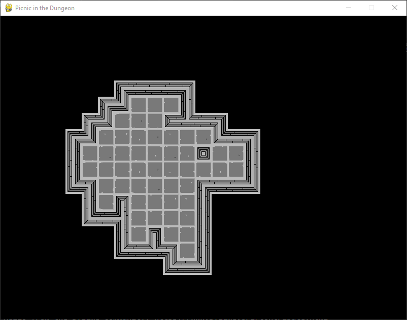
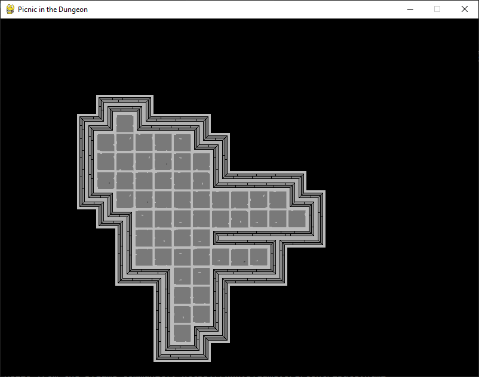
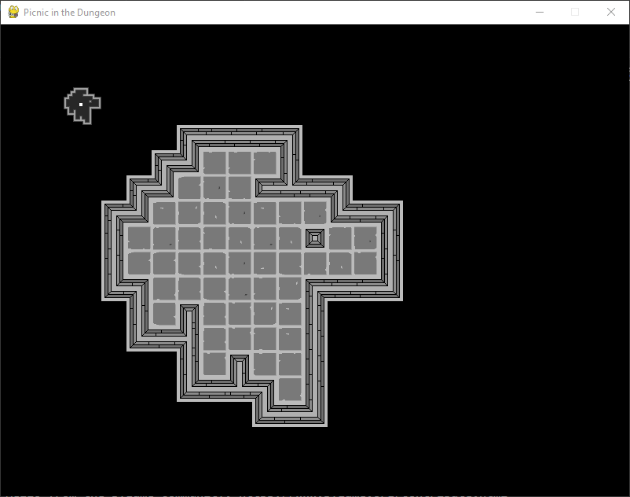
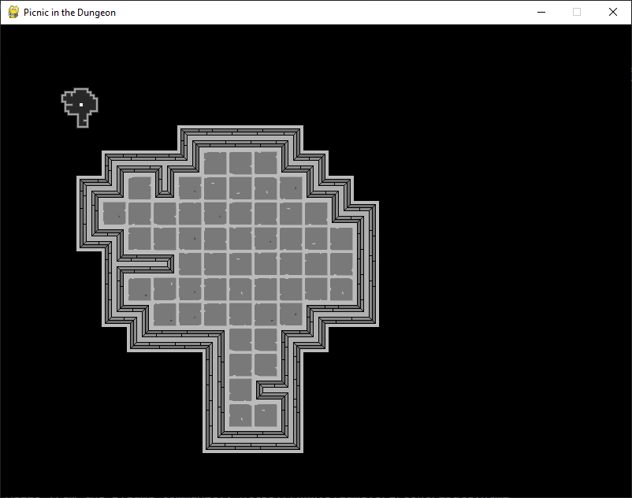
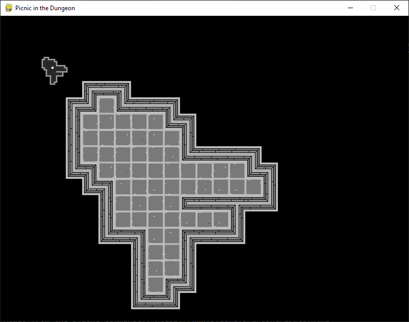
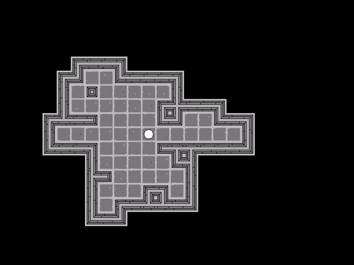
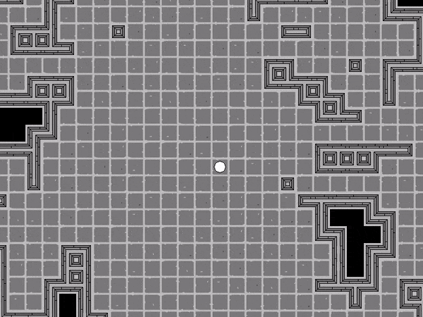
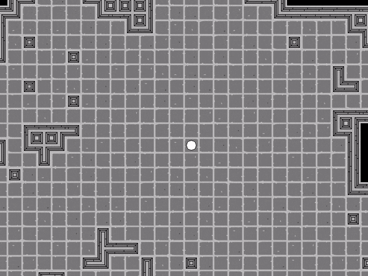
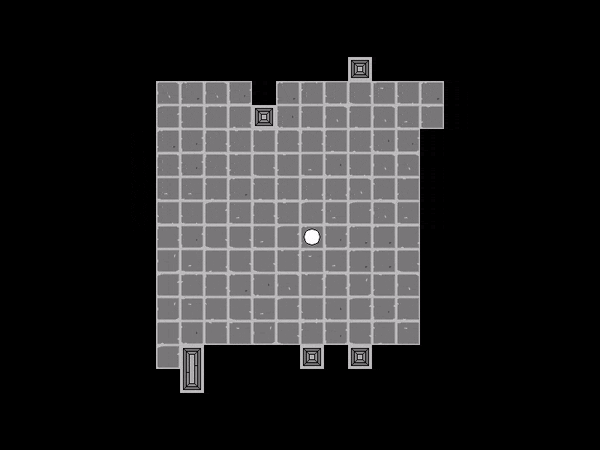

# Picnic in the Dungeon

Jogo de exploração de masmorras com foco no desenvolvimento de habilidades. As masmorras apresentarão alta dificuldade sendo a morte do personagem permanente, no entanto, armas, raças e habilidades serão liberadas para novos personagens à medida que objetivos da masmorra forem alcançados. Será oferecido um sistema de desenvolvimento de habilidades de modo que o usuário possa customizar o seu personagem e por esse motivo não serão fornecidas classes.

Além disso, o jogo também apresentará opções de customização de modo que o usuário possa gerar conteúdo. Isso inclui o desenvolvimento de cenários, quebra-cabeças, armadilhas, equipamentos, armas, poções, além do desenvolvimento de habilidades.

Simple ARPG with rogue like game elements:
- [ ] Turn Based (Strategy)
- [ ] Procedural Map Generation;
- [ ] Permanent Death;
- [ ] High difficulty;
- [ ] Powers Customization (like Daemon Supers[^1]);
- [ ] Rare and Champion Monsters (like Diablo 3[^2]);
- [ ] Puzzles (like Zelda[^3], Pokemon[^4], video games[^5], Goof a Troop[^16] and RPG[^6]);
- [ ] Races, Classes and Weapons (race customization by user choices);
- [ ] Dialog and Conversation Strategies;
- [ ] Environment Interaction (like Brogue[^14], Pokemon[^13] and Metroid[^15]);
- [ ] Map Height, Walter, Caves (like Zelda[^3], Pokemon[^13] and Metroid[^15]);
- [ ] Weapons Strategy (like Brogue[^12]);
- [ ] Strange and Hostil Environment (like Roadside Picnic[^7] and Annihilation[^8] with elements of Debris[^9], Doctor Who[^10] and Darker than Black[^19]);
- [ ] Tower Defense Elements (like traps and defenses in Clash of Clans[^11]);
- [ ] Monster Capture (like Pokemon[^4]);
- [ ] Procedural Quests

[//]: # "Monster formation"
[//]: # "Monster patrol"
[//]: # "Guild missions (explore, escort)"
[//]: # "Procedural missions"

## Progresso

1. Geração aleatória de mapas simples através do algoritmo de passeio aleatório.

     &nbsp;
     &nbsp;
    

2. Geração de minimapa acessado pela tecla 'tab'.

     &nbsp;
     &nbsp;
    

3. Movimentação do Personagem

    

4. Câmera com Foco no Personagem

    

5. Minimapa com Posição do Personagem

    

6. Campo de Visão

    

### Controles

- Tabulação: ativa o minimapa
- Espaço: centraliza a câmera
- Botões direcionais: movimentam o minimapa quando ativo
- Teclado numérico: movimentam o personagem

## Detalhes de Implementação

### Algoritmo de Passeio Aleatório

O algoritmo de passeio aleatório é aplicado para geração procedural de mapas. Recebe a posição inicial do passeio, a quantidade de passos e um conjunto de possíveis direções a serem seguidas (geralmente as direções cardinais) e então efetua o passeio retornando um conjunto de posições representado os espaço em que os personagens podem se mover.

Ele é aplicado na geração no mapa em formato de ilha que consiste em aplicar o passeio uma quantidade N de vezes a partir do centro do mapa de dimensões bidimensional. A quantidade de passos é escolhida como o mínimo entre a metade da largura e metade da altura do mapa. A posição inicial é configurada como o centro do mapa e a posição final como o ponto mais distante do início, considerando somente o passo final de cada passeio. Os mapas gerados por esse processo apresentam o formato de uma grande área concentrada no centro do mapa com ramificações radiais.

Trabalho Futuro
- [ ] Mapa em formato de arquipélago
- [ ] Mapa em formato de continente
- [ ] Mapa em formato de cavernas
- [ ] Mapa em formato de estrela

### Algoritmo de Campo de Visão

Avaliando o estudo efetuado em [^33], escolhemos o algoritmo básico (ray casting) para a implementação do campo de visão. O estudo conclui que o algoritmo é equivalente aos demais em tempo de processamento e gera campos plausíveis nos cenários de pilares e diagonais, além de apresentar boa simetria em mapas fechados, com exceção das situações de cantos perpendiculares. No entanto, o estudo é de 2009 e não há referência disponível para a implementação utilizada.

Nossa implementação utiliza o algoritmo de desenho de linhas de Bresenham [^34], traçando linhas a partir de um centro para cada posição de distância _radius_ considerando a distância de Manhattan. Os pontos em cada linha são ordenados, iniciando no centro considerando visíveis todos os pontos que não encontram obstáculos a partir do centro. Isto é, percorremos as linhas do centro até a borda, considerando todos os pontos visíveis até encontrar um obstáculo.

Trabalho Futuro
- [ ] Alterar o raio do foco de visão
    - [ ] Formato diamante
    - [ ] Formato octogonal
    - [ ] Formato frontal
    - [ ] Formato periférico

### Dependências

pygame [^32]: para implementação de recursos básicos como janela, tratamento de imagens, etc.

## TODO

- [x] Ground System
- [x] Random Walk
- [x] Camera
- [x] Camera Translate
- [x] Mini Map
- [x] Mini Map Controls
- [x] Player Position
- [x] Mini Map Player Position
- [x] Player Directional Controls
- [x] Refactor Position and Dimension
- [x] Field of View
- [x] Field of View Integration with Map
- [ ] Motion System
- [ ] Animation System
- [ ] Collectable System
- [ ] Centralize Minimap
- [ ] Wave Collapse Function
- [ ] Map Geration (Random Walk + Wave Collapse Function)
- [ ] Player Directions Sprites
- [ ] Player Animations
- [ ] Map Levels
- [ ] Binary Spatial Partition Map
- [ ] Cellular Automata Map
- [ ] Voronoy Hive Map

[^1]: [Daemon Powers](https://wiki.daemon.com.br/index.php?title=Supers_RPG)
[^2]: [Diablo 3 - Monters](https://www.reddit.com/r/Diablo/comments/tuhcc/whats_the_difference_between_champion_rare_and/)
[^3]: [Zelda - Puzzles](https://gamerant.com/zelda-hardest-puzzles-how-to-solve/)
[^4]: [Pokemon - Puzzles](https://www.thegamer.com/pokemon-hardest-puzzles-across-all-games-ranked/)
[^5]: [Video Game - Puzzles](https://www.denofgeek.com/games/hardest-video-game-puzzles/)
[^6]: [RPG - Puzzles](https://www.reddit.com/r/rpg/comments/1l72cw/10000_greatest_traps_puzzles/)
[^7]: [Roadside Picnic](https://en.wikipedia.org/wiki/Roadside_Picnic)
[^8]: [Annihilation ](https://en.wikipedia.org/wiki/Annihilation_(VanderMeer_novel))
[^9]: [Debris ](https://en.wikipedia.org/wiki/Debris_(TV_series))
[^11]: [Clash of Clans](https://en.wikipedia.org/wiki/Clash_of_Clans)
[^10]: [Doctor Who](https://pt.wikipedia.org/wiki/Doctor_Who)
[^12]: [Brogue - Weapons](https://brogue.fandom.com/wiki/Category:Weapon)
[^13]: [Pokemon Moves](https://bulbapedia.bulbagarden.net/wiki/Field_move)
[^14]: [Brogue - Terrain](https://brogue.fandom.com/wiki/Terrain_Features)
[^15]: [Metroid Powers](https://metroid.fandom.com/wiki/Super_Metroid#Power-ups_and_suit_upgrades)
[^16]: [Goof Troop - Pluzzes](http://playingwithsuperpower.com/goof-troop-review/)
[^17]: [ANSI Escape Codes](https://gist.github.com/fnky/458719343aabd01cfb17a3a4f7296797)
[^18]: [Rogue Like with Rust](https://bfnightly.bracketproductions.com/chapter_0.html)
[^19]: [Darker than Black](https://en.wikipedia.org/wiki/Darker_than_Black)

[^32]: [Pygame](https://www.pygame.org/news)
[^33]: [Comparative study of field of view algorithms for 2D grid based worlds](https://www.roguebasin.com/index.php/Comparative_study_of_field_of_view_algorithms_for_2D_grid_based_worlds)
[^34]: [Bresenham's line algorithm](https://en.wikipedia.org/wiki/Bresenham%27s_line_algorithm)

[^31]: [Configure Key GIT](https://roelofjanelsinga.com/articles/how-to-setup-gpg-signing-keys-in-github/#:~:text=How%20to%20get%20the%20verified%20flag%20on%20your,use%20your%20GPG%20key%20to%20sign%20commits%20)
[^20]: [triangle rasterization](http://www.sunshine2k.de/coding/java/TriangleRasterization/TriangleRasterization.html)
[^21]: [line rasterization](https://www.javatpoint.com/computer-graphics-bresenhams-line-algorithm)
[^22]: [Field of View](https://www.researchgate.net/publication/347719548_New_Algorithms_for_Computing_Field_of_Vision_over_2D_Grids)
[^23]: [Field of View - Rogue](http://www.roguebasin.com/index.php/Comparative_study_of_field_of_view_algorithms_for_2D_grid_based_worlds)
[^24]: [Game Algorithms](https://www.phstudios.com/game-algorithm-series/)
[^25]: [Brogue](https://sites.google.com/site/broguegame/)
[^26]: [Multiple Body](https://www.gridsagegames.com/blog/2020/04/developing-multitile-creatures-roguelikes/)
[^27]: [IA] (http://www.roguebasin.com/index.php/Roguelike_Intelligence_-_Stateless_AIs)
[^28]: [IA - path](https://news.ycombinator.com/item?id=22848888)
[^29]: [Dijkstra map](http://www.roguebasin.com/index.php?title=The_Incredible_Power_of_Dijkstra_Maps)
[^30]: [Dijkstra map - Rogue Basin](http://www.roguebasin.com/index.php/Dijkstra_Maps_Visualized)

